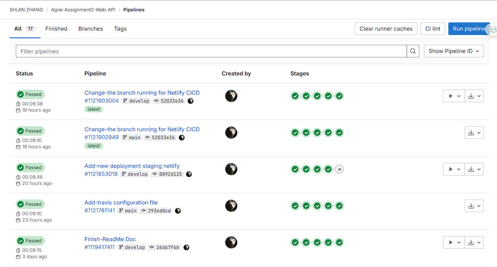
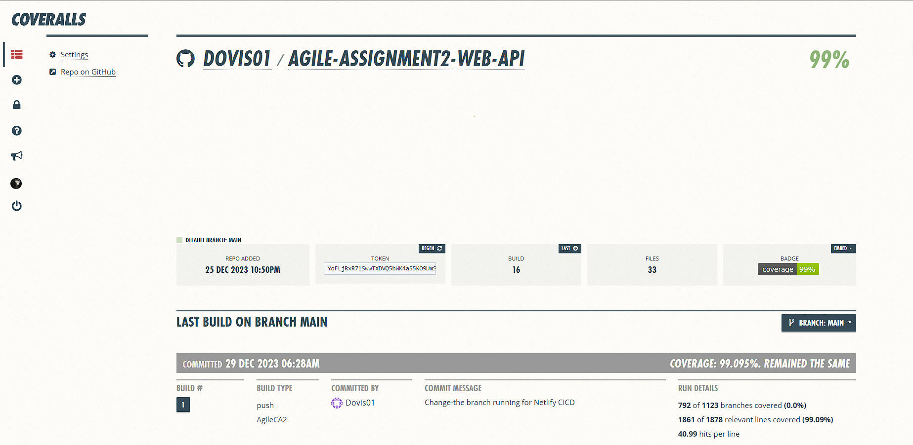

# Assignment 2 - Agile Software Practice.

Name: Shijin Zhang

Links:
+ Coveralls: https://coveralls.io/github/Dovis01/Agile-Assignment2-Web-API
+ Gitlab: https://gitlab.com/Dovis01/agile-assignment2-web-api
+ Github: https://github.com/Dovis01/Agile-Assignment2-Web-API
+ Netlify: https://app.netlify.com/teams/zsj1364226740/overview
+ [](https://coveralls.io/github/Dovis01/Agile-Assignment2-Web-API?branch=main)  [](https://app.netlify.com/sites/peppy-lokum-ce89b7/deploys) [](https://app.travis-ci.com/liang765407782/sjz-coveralls)

## API endpoints.

#### **Movies:**

- `/api/movies/tmdb/discover?page={pagenumber}` | GET | Gets a list of discover movies
- `/api/movies/tmdb/nowplaying?page={pagenumber}` | GET | Gets a list of nowplaying movies
- `/api/movies/tmdb/{movieid}` | GET | Gets details of a single movie
- `/api/movies/tmdb/{movieid}/images` | GET | Gets images of a single movie
- `/api/movies/tmdb/{movieid}/videos` | GET | Gets videos of a single movie
- `/api/movies/tmdb/{movieid}/recommendations?page={pagenumber}` | GET | Gets recommendations for a single movie
- `/api/movies/tmdb/{movieid}/reviews` | GET | Gets reviews of a single movie
- `/api/movies/tmdb/week_trending?page={pagenumber}` | GET | Gets a list of weekly trending movies

#### **People:**

- `/api/people/{personid}` | GET | Retrieves details of a specific person from  database storage
- `/api/people` | GET | Retrieves a list of all people from  database storage
- `/api/people/tmdb/{personid}` | GET | Gets TMDB details of a specific person
- `/api/people/tmdb/{personid}/images` | GET | Gets images of a specific person from TMDB
- `/api/people/tmdb/{personid}/tv_credits` | GET | Gets TV credits of a specific person from TMDB
- `/api/people/tmdb/{personid}/movie_credits` | GET | Gets movie credits of a specific person from TMDB
- `/api/people/tmdb/popular_people?page={pagenumber}` | GET | Gets a list of popular people from TMDB
- `/api/people/tmdb/week_trending?page={pagenumber}` | GET | Gets a list of weekly trending people from TMDB

#### **Users:**

- `/api/users/{userid}` | GET | Retrieves details of a specific user
- `/api/users` | GET | Retrieves a list of all users
- `/api/users?action=register` | POST | Registers a new user
- `/api/users?authMethod=email` | POST | Authenticates a user via email
- `/api/users?authMethod=username` | POST | Authenticates a user via username
- `/api/user/delete/{userid} (Auth) ` | DELETE | Deletes a specific user
- `/api/user/update/{userid} (Auth) ` | PUT | Updates details of a specific user

#### **Favorites (Auth)  :**

- `/api/favorites` | GET | Retrieves  all favorites data
- `/api/favorites/{userid}` | GET | Retrieves favorites for a specific user
- `/api/favorites/{userid}/movies/{movieid}` | POST | Adds a movie to a user's favorites
- `/api/favorites/{userid}/movies/{movieid}` | DELETE | Removes a movie from a user's favorites

#### **ToWatchList (Auth) :**

- `/api/toWatchList` | GET | Retrieves all towatchlist data
- `/api/toWatchList/{userid}` | GET | Retrieves a specific user's watchlist
- `/api/toWatchList/{userid}/movies/{movieid}` | POST | Adds a movie to a user's towatchlist
- `/api/toWatchList/{userid}/movies/{movieid}` | DELETE | Removes a movie from a user's towatchlist

#### **Reviews (Auth) :**

- `/api/reviews` | GET | Retrieves all reviews data
- `/api/reviews/{movieid}` | GET | Retrieves reviews for a specific movie
- `/api/reviews/{userid}` | GET | Retrieves all movie ids reviewed by a specific user
- `/api/reviews/{userid}/movies/{movieid}`  | GET | Retrieves reviews of a movie submitted by a specific user
- `/api/reviews/{reviewid}/{userid}/movies/{movieid}` | GET | Retrieves a specific review of a specific movie of a user
- `/api/reviews/{userid}/movies/{movieid}` | POST | Submits a new review for a specific movie of a specific user
- `/api/reviews/{reviewid}/{userid}/movies/{movieid}`  | PUT | Updates a new review for a specific movie of a sepcific user
- `/api/reviews/{reviewid}/{userid}/movies/{movieid}` | DELETE | Deletes a specific review

## Automated Testing.

#### Test Output From Terminal:

~~~txt
  Users endpoint                                
    Unauthenticated scenarios for users endpoint
      GET /api/users                            
        √ should return the 3 users and a status 200
      GET /api/users/:username                     
        when the request username actually exists  
          √ should return the specific user details and a status 200
        when the request username actually does not exist  
          √ should return the NOT found message and a status 404
      POST /api/users                        
        For a register action like signing up
          when the request body params (payload) are correct
            √ should return a 201 status and the confirmation message for creating successfully 
            √ should return a 201 status and the confirmation message for password length is 8 
            √ should return a 201 status and the confirmation message for password length is 15 
          when the request body params (payload) are incorrect
            when the request params (payload) is empty 
              √ should return a 400 status code and the error message for requiring three fields
            when one of the unique request params (payload) already exists 
              √ should return a 401 status and the error message for username already exists (44ms)
              √ should return a 401 status and the error message for email already exists (45ms)
            when the password in payload is invalid 
              √ should return a 400 status and the error message for password is too short (43ms)
              √ should return a 400 status and the error message for password is too long (43ms)
              √ should return a 400 status and the error message for password does not match passwordValidator (42ms)
        For an authenticate action like signing in
          when the authentication method is by username and the payload is correct
            when the payload is correct
              √ should return a 200 status and a generated token (81ms)
            when the payload is not correct
              √ should return a 404 status and fail to authenticate for incorrect username
              √ should return a 401 status and fail to authenticate for wrong password (83ms)
          when the authentication method is by email and the payload is correct
            when the payload is correct
              √ should return a 200 status and a generated token (78ms)
            when the payload is not correct
              √ should return a 404 status and fail to authenticate for incorrect email
              √ should return a 401 status and fail to authenticate for wrong password (75ms)
    Authenticated scenarios for users endpoint
      PUT /api/user/update/:username 
        when there is no update payload 
          √ should return error and status 400 for missing all required fields (48ms)
        For updating users' basic information 
          when payload for users' info is valid
            √ should return success message and status 200 for updating info successfully (53ms)
          when payload for users' info is invalid 
            √ should return error and status 400 for missing some required field (address)
            √ should return error and status 404 for updating error username (81ms)
        For updating users' password 
          when payload for users' password is valid
            √ should return success message and status 200 for updating password successfully 
          when payload for users' password is invalid 
            √ should return error and status 400 for not passing passwordValidator
            √ should return error and status 404 for updating error username password (98ms)
        For updating users' avatar 
          when payload for users' avatar is valid
            √ should return success message and status 200 for updating avatar successfully (58ms)
          when payload for users' avatar is invalid 
            √ should return error and status 404 for updating error username avatar (47ms)
      DELETE /api/user/delete/:username 
        when url param for user's username is valid
          √ should return success message and status 200 for deleting user successfully (48ms)
        when url param for user's username is invalid 
          √ should return error and status 404 for deleting error username (44ms)

  Movies endpoint
    Movies source data from database storage
      GET /api/movies
        √ should return 20 movies and a status 200 (39ms)
      GET /api/movies/:id
        when the id is valid
          √ should return the matching movie
        when the id is invalid
          √ should return the NOT found message
    Movies source data from TMDB 
      GET /api/movies/tmdb/discover?page={PageNumber}
        when the request page about discover movies is valid
          √ should return 40 movies and a status 200 for normal page (105ms)
          √ should return 20 movies and a status 200 for min page (76ms)
          √ should return 20 movies and a status 200 for max page (72ms)
        when the request page about discover movies is invalid
          √ should return the bad request message for invalid page which is not a number
          √ should return the bad request message for less than min page
          √ should return the bad request message for greater than max page
      GET /api/movies/tmdb/upcoming?page={PageNumber}
        when the request page about upcoming movies is valid
          √ should return 40 movies and a status 200 for normal page (73ms)
          √ should return 20 movies and a status 200 for min page (78ms)
          √ should return 20 movies and a status 200 for max page (75ms)
        when the request page about upcoming movies is invalid
          √ should return the bad request message for invalid page which is not a number
          √ should return the bad request message for less than min page
          √ should return the bad request message for greater than max page
      GET /api/movies/tmdb/nowplaying?page={PageNumber}
        when the request page about nowplaying movies is valid
          √ should return 40 movies and a status 200 for normal page (83ms)
          √ should return 20 movies and a status 200 for min page (79ms)
          √ should return 20 movies and a status 200 for max page (79ms)
        when the request page about nowplaying movies is invalid
          √ should return the bad request message for invalid page which is not a number
          √ should return the bad request message for less than min page
          √ should return the bad request message for greater than max page
      GET /api/movies/tmdb/week_trending?page={PageNumber}
        when the request page about week trending movies is valid
          √ should return 40 movies and a status 200 for normal page (72ms)
          √ should return 20 movies and a status 200 for min page (77ms)
          √ should return 20 movies and a status 200 for max page (162ms)
        when the request page about week trending movies is invalid
          √ should return the bad request message for invalid page which is not a number
          √ should return the bad request message for less than min page
          √ should return the bad request message for greater than max page
      GET /api/movies/tmdb/:id/recommendations?page={PageNumber}
        when the request about movie recommendations succeeds
          √ should return 40 movies and a status 200 for normal page and movie id (81ms)
        when the request about movie recommendations fails
          when the request page about movie recommendations is invalid
            √ should return the bad request message for invalid page which is not a number
            √ should return the bad request message for less than min page
            √ should return the bad request message for greater than max page
          when the request movie id about movie recommendations is invalid
            √ should return the bad request message for invalid movie id (156ms)
      GET /api/movies/tmdb/genres
        √ should return all movie genres and a status 200 (84ms)
      GET /api/movies/tmdb/:id/images
        when the request movie id about movie images is valid
          √ should return movie images and a status 200 (70ms)
        when the request movie id about movie images is invalid
          √ should return the NOT found message for movie images (148ms)
      GET /api/movies/tmdb/:id/videos
        when the request movie id about movie videos is valid
          √ should return movie videos and a status 200 (76ms)
        when the request movie id about movie videos is invalid
          √ should return the NOT found message for movie videos (152ms)
      GET /api/movies/tmdb/:id/credits
        when the request movie id about movie credits is valid
          √ should return movie related credits and a status 200 (72ms)
        when the request movie id about movie credits is invalid
          √ should return the NOT found message for movie related credits (183ms)
      GET /api/movies/tmdb/:id/reviews
        when the request movie id about movie reviews is valid
          √ should return movie related reviews and a status 200 (149ms)
        when the request movie id about movie reviews is invalid
          √ should return the NOT found message for movie related reviews (146ms)
      GET /api/movies/tmdb/:id
        when the movie id is valid
          √ should return the matching movie (64ms)
        when the movie id is invalid
          √ should return the NOT found message (154ms)

  People endpoint
    People source data from database storage
      GET /api/people
        √ should return 2 people and a status 200
      GET /api/people/:id
        when the id is valid
          √ should return the matching people
        when the id is invalid
          √ should return the NOT found message
    People source data from TMDB 
      GET /api/people/tmdb/popular_people?page={PageNumber}
        when the request page about popular people is valid
          √ should return 40 people and a status 200 for normal page (91ms)
          √ should return 40 people and a status 200 for min page (74ms)
          √ should return 40 people and a status 200 for max page (81ms)
        when the request page about popular people is invalid
          √ should return the bad request message for invalid page which is not a number
          √ should return the bad request message for less than min page
          √ should return the bad request message for greater than max page
      GET /api/people/tmdb/week_trending?page={PageNumber}
        when the request page about week trending people is valid
          √ should return 40 people and a status 200 for normal page (91ms)
          √ should return 40 people and a status 200 for min page (83ms)
          √ should return 40 people and a status 200 for max page (89ms)
        when the request page about week trending people is invalid
          √ should return the bad request message for invalid page which is not a number
          √ should return the bad request message for less than min page
          √ should return the bad request message for greater than max page
      GET /api/people/tmdb/:id
        when the people id is valid
          √ should return the matching people (70ms)
        when the people id is invalid
          √ should return the NOT found message (154ms)
      GET /api/people/tmdb/:id/images
        when the request people id about people images is valid
          √ should return people images and a status 200 (71ms)
        when the request people id about people images is invalid
          √ should return the NOT found message for people images (139ms)
      GET /api/people/tmdb/:id/movie_credits
        when the request person id about person related movie credits is valid
          √ should return person related movie credits and a status 200 (75ms)
        when the request person id about person related movie credits is invalid
          √ should return the NOT found message for person related movie credits (151ms)
      GET /api/people/tmdb/:id/tv_credits
        when the request person id about person related tv credits is valid
          √ should return person related tv credits and a status 200 (69ms)
        when the request person id about person related tv credits is invalid
          √ should return the NOT found message for person related tv credits (147ms)

  Reviews endpoint
    Unauthenticated scenarios for reviews endpoint
      √ should return a 500 status code if the user is unauthenticated
    Authenticated scenarios for reviews endpoint 
      GET /api/reviews 
        √ should return the 2 reviews data and a status 200 (57ms)
      GET /api/reviews/:username 
        when the request username actually exists
          √ should return reviewed movie ids of the specific user and a status 200 (47ms)
        when the request username actually does not exist  
          √ should return the NOT found message and a status 404 (40ms)
      GET /api/reviews/:username/movies/:movieId 
        when the request username and movieId are valid
          √ should return all reviews record of the specific movie reviewed by the user and a status 200 (47ms)
        when the request url is wrong 
          when the request username is invalid
            √ should return the NOT found message and a status 404 (50ms)
          when the request movie id is invalid 
            √ should return the NOT found message and a status 404 (43ms)
      GET /api/reviews/:reviewId/:username/movies/:movieId 
        when the request reviewId, username and movieId are valid
          √ should return a specific review record of the specific movie reviewed by the user and a status 200 (47ms)
        when the request url is wrong 
          when the request review id is invalid
            √ should return the NOT found message and a status 404 (44ms)
          when the request username is invalid 
            √ should return the NOT found message and a status 404 (39ms)
          when the request movie id is invalid 
            √ should return the NOT found message and a status 404 (45ms)
      POST /api/reviews/:username/movies/:movieId 
        when username and movieId of the post request are valid and the username which has review records
          √ should return the new entire review records and a status 200 (81ms)
        when username and movieId of the post request are valid and the username which does not have review records  
          √ should return the new entire review records of a new username and a status 200 (75ms)
      PUT /api/reviews/:reviewId/:username/movies/:movieId 
        when the put request succeeds  
          √ should return the updated entire review records and a status 200 (47ms)
        when the put request fails  
          when some of payload of put request is empty  
            √ should return the bad request and a status 400
          when the put request url is invalid  
            when the request review id is invalid
              √ should return the NOT found message and a status 404 (40ms)
            when the request username is invalid 
              √ should return the NOT found message and a status 404 (41ms)
            when the request movie id is invalid 
              √ should return the NOT found message and a status 404 (45ms)
      DELETE /api/reviews/:reviewId/:username/movies/:movieId 
        when the delete request are valid and the username which has more than one review record
          √ should return the deleted entire review records and a status 200 (49ms)
        when the delete request are valid and the username which has just last one review record  
          √ should return the confirmation information for deleting the last one successfully and a status 200 (81ms)

  Favorites endpoint
    Unauthenticated scenarios for favorites endpoint
      √ should return a 500 status code if the user is unauthenticated
    Authenticated scenarios for favorites endpoint 
      GET /api/favorites 
        √ should return the 2 favorites data and a status 200 (53ms)
      GET /api/favorites/:username 
        when the request username actually exists
          √ should return favorite movie ids of the specific user and a status 200 (60ms)
        when the request username actually does not exist  
          √ should return the NOT found message and a status 404 (45ms)
      POST /api/favorites/:username/movies/:movieId 
        when username and movieId of the post request are valid and the username which has favorites records
          √ should return the new entire favorites records and a status 200 (85ms)
        when username and movieId of the post request are valid and the username which does not have favorites records  
          √ should return the new entire favorites records of a new username and a status 200 
      DELETE /api/favorites/:username/movies/:movieId 
        when the delete request are valid and the username which has more than one favorites record  
          √ should return the deleted entire favorites records and a status 200 (50ms)
        when the delete request are valid and the username which has just last one favorites record  
          √ should return the confirmation information for deleting the last one successfully and a status 200 (77ms)
        when the delete request fails  
          when the username of delete request is invalid  
            √ should return the NOT found message and a status 404 (43ms)
          when the movie id of delete request is invalid  
            √ should return the NOT found message and a status 404 (44ms)

  ToWatchLists endpoint
    Unauthenticated scenarios for toWatchList endpoint
      √ should return a 500 status code if the user is unauthenticated
    Authenticated scenarios for toWatchList endpoint 
      GET /api/toWatchList 
        √ should return the 2 toWatchList data and a status 200 (51ms)
      GET /api/toWatchList/:username 
        when the request username actually exists
          √ should return toWatchList movie ids of the specific user and a status 200 (53ms)
        when the request username actually does not exist  
          √ should return the NOT found message and a status 404 (58ms)
      POST /api/toWatchList/:username/movies/:movieId 
        when username and movieId of the post request are valid and the username which has toWatchList records
          √ should return the new entire toWatchList records and a status 200 (88ms)
        when username and movieId of the post request are valid and the username which does not have toWatchList records  
          √ should return the new entire toWatchList records of a new username and a status 200 
      DELETE /api/toWatchList/:username/movies/:movieId 
        when the delete request is valid and the username which has more than one toWatchList record  
          √ should return the deleted entire toWatchList records and a status 200 (58ms)
        when the delete request are valid and the username which has just last one toWatchList record  
          √ should return the confirmation information for deleting the last one successfully and a status 200 (73ms)
        when the delete request fails  
          when the username of delete request is invalid  
            √ should return the NOT found message and a status 404 (46ms)
          when the movie id of delete request is invalid  
            √ should return the NOT found message and a status 404 (47ms)


  135 passing (31s)

~~~

## Deployments.

##### Staging Server:

- https://agile-web-api-ca2-staging-zsj-fd0f5b4f395b.herokuapp.com/api/movies
- https://agile-web-api-ca2-staging-zsj-fd0f5b4f395b.herokuapp.com/api/users
- https://agile-web-api-ca2-staging-zsj-fd0f5b4f395b.herokuapp.com/api/movies/tmdb/discover?page=1

Evidence:


##### Production Server:

- https://agile-web-api-ca2-produc-zsj-215579e0f1c1.herokuapp.com/api/movies
- https://agile-web-api-ca2-produc-zsj-215579e0f1c1.herokuapp.com/api/users
- https://agile-web-api-ca2-produc-zsj-215579e0f1c1.herokuapp.com/api/movies/tmdb/discover?page=1

Evidence:


#### CI CD：




## Independent Learning (if relevant)

#### Istanbul Generated Code Coverage Reports:

```shell
------------------------------------------------------|---------|----------|---------|---------|
File                                                  | % Stmts | % Branch | % Funcs | % Lines |
------------------------------------------------------|---------|----------|---------|---------|
All files                                             |   96.94 |    70.52 |   99.04 |   99.09 |                                          
 moviesApiAssignment                                  |   97.67 |       75 |     100 |   97.61 |                                          
  index.js                                            |   97.67 |       75 |     100 |   97.61 |                                       
 moviesApiAssignment/api                              |   93.36 |    62.63 |   91.04 |   92.81 |                                          
  tmdb-api.js                                         |   93.36 |    62.63 |   91.04 |   92.81 | 
  
 moviesApiAssignment/api/favorites                    |   95.08 |    72.15 |     100 |   98.57 |                                          
  favoriteModel.js                                    |     100 |      100 |     100 |     100 |                                          
  index.js                                            |   94.78 |    71.42 |     100 |   98.43 |                                       
 moviesApiAssignment/api/movies                       |    98.1 |    84.95 |     100 |     100 |                                          
  index.js                                            |   98.03 |    84.68 |     100 |     100 |                         
  movieModel.js                                       |     100 |      100 |     100 |     100 |                                          
 moviesApiAssignment/api/people                       |   98.54 |    81.25 |     100 |     100 |                                          
  index.js                                            |   98.46 |    80.76 |     100 |     100 |                              
  peopleModel.js                                      |     100 |      100 |     100 |     100 |                                          
 moviesApiAssignment/api/reviews                      |    94.3 |    79.13 |     100 |   99.17 |                                          
  index.js                                            |   93.88 |    78.76 |     100 |   99.09 |                                        
  reviewModel.js                                      |     100 |      100 |     100 |     100 |                                          
 moviesApiAssignment/api/toWatchList                  |   95.08 |    72.15 |     100 |   98.57 |                                          
  index.js                                            |   94.78 |    71.42 |     100 |   98.43 |                                       
  toWatchListModel.js                                 |     100 |      100 |     100 |     100 |                                          
 moviesApiAssignment/api/users                        |   96.68 |    76.51 |     100 |     100 |                                          
  index.js                                            |   97.39 |    85.26 |     100 |     100 |                                
  userModel.js                                        |   94.44 |    54.05 |     100 |     100 |                                   
 moviesApiAssignment/api/users/deleteUser             |   95.45 |       60 |     100 |     100 |                                          
  index.js                                            |   95.45 |       60 |     100 |     100 |                                       
 moviesApiAssignment/api/users/updateUser             |   95.69 |    80.26 |     100 |     100 |                                          
  index.js                                            |   95.69 |    80.26 |     100 |     100 |                           
 moviesApiAssignment/authenticate                     |   88.88 |    56.81 |     100 |     100 |                                          
  index.js                                            |   88.88 |    56.81 |     100 |     100 |                             
 moviesApiAssignment/db                               |     100 |      100 |      50 |     100 |                                          
  index.js                                            |     100 |      100 |      50 |     100 |                                          
 moviesApiAssignment/errHandler                       |      80 |       50 |     100 |      80 |                                          
  index.js                                            |      80 |       50 |     100 |      80 |                                         
 moviesApiAssignment/seedData                         |   94.17 |    60.93 |     100 |     100 |                                          
  favorites.js                                        |     100 |      100 |     100 |     100 |                                          
  index.js                                            |   93.25 |    60.93 |     100 |     100 |                                  
  movies.js                                           |     100 |      100 |     100 |     100 |                                          
  people.js                                           |     100 |      100 |     100 |     100 |                                          
  reviews.js                                          |     100 |      100 |     100 |     100 |                                           
  toWatchList.js                                      |     100 |      100 |     100 |     100 |                                          
  userAvatar.js                                       |     100 |      100 |     100 |     100 |                                          
  users.js                                            |     100 |      100 |     100 |     100 |                                          
 moviesApiAssignment/tests/functional/api/favorites   |    98.5 |    59.45 |     100 |     100 |                                          
  index.js                                            |    98.5 |    59.45 |     100 |     100 |                                  
 moviesApiAssignment/tests/functional/api/movies      |   99.16 |    51.51 |     100 |     100 |                                          
  index.js                                            |   99.16 |    51.51 |     100 |     100 |                                 
 moviesApiAssignment/tests/functional/api/people      |   98.65 |    51.51 |     100 |     100 |                                          
  index.js                                            |   98.65 |    51.51 |     100 |     100 |                                  
 moviesApiAssignment/tests/functional/api/reviews     |   98.97 |    59.45 |     100 |     100 |                                          
  index.js                                            |   98.97 |    59.45 |     100 |     100 |                               
 moviesApiAssignment/tests/functional/api/toWatchList |    98.5 |    59.45 |     100 |     100 |                                          
  index.js                                            |    98.5 |    59.45 |     100 |     100 |                                   
 moviesApiAssignment/tests/functional/api/users       |   98.96 |    54.28 |     100 |     100 |                                          
  index.js                                            |   98.96 |    54.28 |     100 |     100 |
------------------------------------------------------|---------|----------|---------|---------|
```

#### Coveralls Server：

Visit this coveralls server website to check Code Coverage Reports for the tests:  https://coveralls.io/github/Dovis01/Agile-Assignment2-Web-API



#### Incorporate the generation and publication of the code coverage reports as part of the CI pipeline:

###### You can check files:

`package.json` : https://github.com/Dovis01/Agile-Assignment2-Web-API/blob/main/package.json

`.gitlab-ci.yml`: https://github.com/Dovis01/Agile-Assignment2-Web-API/blob/main/.gitlab-ci.yml

`.travis.yml`: https://github.com/Dovis01/Agile-Assignment2-Web-API/blob/main/.travis.yml

###### Sample code for package.json :

```json
"scripts": {
    ...
    "start": "babel-node index.js",
    "dev": " nodemon --exec npm start",
    "test": "cross-env NODE_ENV=test SEED_DB=true nyc mocha tests/**/*.js",
    "coverage": "nyc report --reporter=text-lcov | coveralls --repo-token=$COVERALLS_REPO_TOKEN"
  },
```

###### Sample code for .gitlab-ci.yml :

```yaml
...
# Jobs:

install_dependencies:
  stage: install
  script:
    - npm  ci

build_api:
  stage: build
  before_script:
    - npm run clean
  script:
    - npm run build

test_api:
  stage: test
  script:
    - npm test
    - npm run coverage
    
...    
```

###### Sample code for .travis.yml :

```yaml
...
before_script:
  - npm run clean
  - npm run build

script:
  - npm test

after_success:
  - npm run coverage
```


#### Travis CI Platform:

I have added a new CI method for uploading the Code Coverage Reports by  Travis CI.
`.travis.yml`: https://github.com/Dovis01/Agile-Assignment2-Web-API/blob/main/.travis.yml


#### Netlify Deployment Platform:

I have deployed some endpoints into the Netlify platform as new deployment platform additionally.


#### Swagger Web APIs Document:

When this movies-api server is running, you can visit this api server's document by visiting swagger.

- Link: 
  - https://agile-web-api-ca2-produc-zsj-215579e0f1c1.herokuapp.com/api-docs/
  - https://agile-web-api-ca2-staging-zsj-fd0f5b4f395b.herokuapp.com/api-docs/


